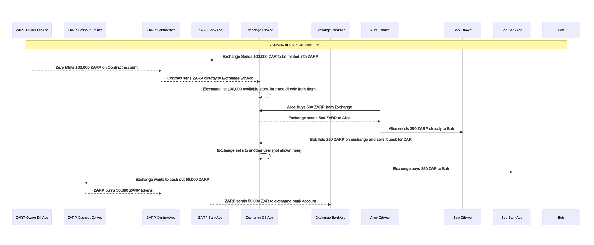

# ZARP

An ERC20 token pegged to ZAR

- Backed 1:1 by real ZAR holdings
- Frequently audited
- Minted and Burned only to/from verified accounts

## Overview

## Contribute

Check out our [contribution guide](CONTRIBUTING.md)!

## Credits

So many people helped and inspired us in this project. We would however specifically like to thank:

- [@nuwrldnf8r](https://github.com/nuwrldnf8r) - for the initial example, and patient help with many aspects of ETH dev
- [@stephen101](https://github.com/stephen101) - much help with the unit testing and more ETH dev knowledge

## License

ZARP is released under the MIT License.
